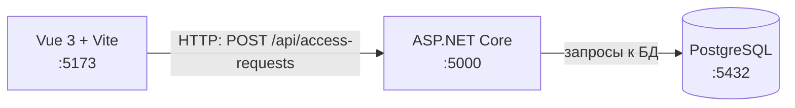

# Архитектура. Тема: Допуск в лабораторию

```
Vue 3 + Vite             ASP.NET Core              PostgreSQL
localhost:5173  ───────► localhost:5000  ───────► localhost:5432
        POST /api/access-requests        запросы к БД
                  HTTP
```



**архитектура web-ИС семестра**

Три узла и две стрелки. Прямой стрелки от браузера к базе нет: иначе клиент получал бы доступ к данным в обход серверных правил. Единственный источник правды о заявках — PostgreSQL, доступ к нему только через ASP.NET Core.
