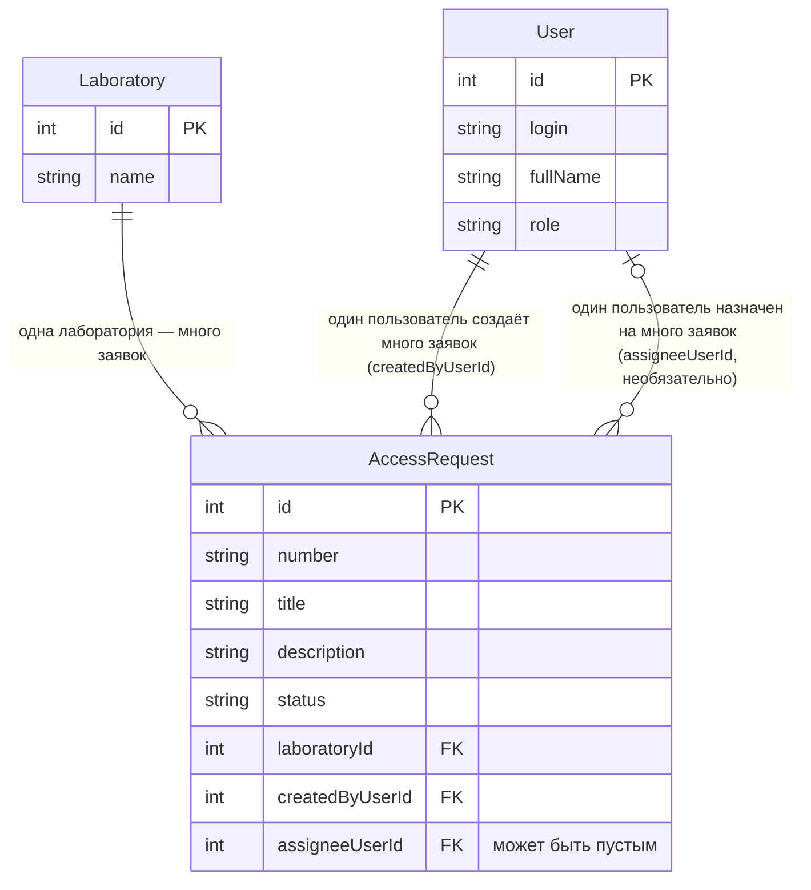

# Модель данных. Тема: Допуск в лабораторию

Связано с: [lab-01-requirements.md](lab-01-requirements.md), [api-contract.md](api-contract.md)

## Словарь проекта

| Термин курса | Термин моей темы |
|---|---|
| Ticket | Заявка на допуск (`AccessRequest`) |
| Site | Лаборатория (`Laboratory`) |
| User | Студент / Инженер лаборатории / Заведующий лабораторией |

Дальше в документах используется только термин «заявка на допуск» (`AccessRequest`).

## Сущности

### AccessRequest (главный объект)

| Поле | Тип | Ключ | Пояснение |
|---|---|---|---|
| `id` | integer | PK | машинный идентификатор, ставит сервер |
| `number` | text | — | человеческий номер, например «ДОП-104», ставит сервер |
| `title` | text (5–80) | — | заголовок |
| `description` | text (10–500) | — | описание |
| `status` | text | — | New, InProgress, Closed, Cancelled |
| `laboratoryId` | integer | FK → Laboratory.id | лаборатория |
| `createdByUserId` | integer | FK → User.id | кто создал (студент) |
| `assigneeUserId` | integer, NULL | FK → User.id | исполнитель; при создании пустой |

### Laboratory (справочник)

| Поле | Тип | Ключ |
|---|---|---|
| `id` | integer | PK |
| `name` | text | — |

### User (пользователь)

| Поле | Тип | Ключ | Пояснение |
|---|---|---|---|
| `id` | integer | PK | |
| `login` | text | — | уникальный |
| `fullName` | text | — | |
| `role` | text | — | Student, Engineer, Head |

`id` и `number` — разные поля: `id` используется в адресах (`/api/access-requests/17`), `number` показывается человеку.

## ER-диаграмма

Связи словами:

- одна лаборатория — много заявок;
- один студент создаёт много заявок;
- один инженер может быть назначен на много заявок;
- у новой заявки исполнителя может не быть (0 или 1 исполнитель).

## Проверка 3НФ

Название лаборатории хранится в сущности Laboratory один раз. AccessRequest содержит только внешний ключ `laboratoryId`. При переименовании лаборатории меняется одна строка, поэтому текст названия не дублируется в заявках.
